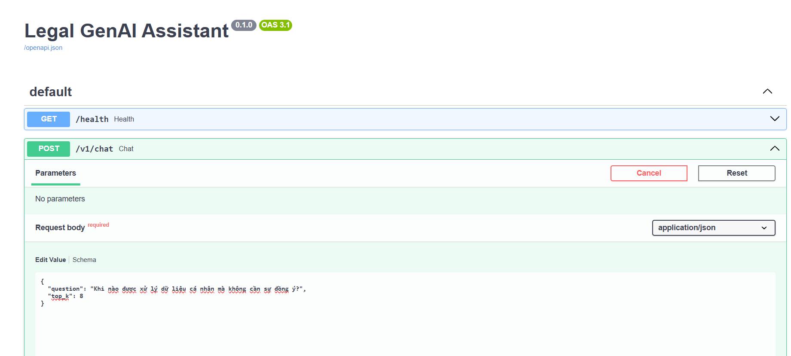

# Legal GenAI Assistant (RAG-based)

## 1. Overview
**Legal GenAI Assistant** is a Retrieval-Augmented Generation (RAG) system designed to answer questions related to Vietnamese technology law, including:
- Personal Data Protection
- Cybersecurity & Information Security
- Electronic Transactions

The system prioritizes **accuracy, traceability, and debuggability**, making it suitable for real-world legal information lookup rather than a generic chatbot.

---

## 2. Why RAG for Legal Domain?
Legal content is:
- **Jurisdiction-specific** (Vietnamese law)
- **Highly structured** (articles, clauses, points)
- **Sensitive to hallucination**

Using a pure LLM risks producing incorrect or outdated legal information. RAG allows the system to:
- Ground answers in official legal documents
- Provide citations (source, page)
- Update knowledge by re-indexing documents instead of retraining models

---

## 3. System Architecture

```
Client (Browser / Gradio / Script)
        |
        v
FastAPI Backend (API Layer)
        |
        v
RAG Pipeline
  ├─ Retriever (FAISS + Embeddings)
  ├─ Context Builder (with citation metadata)
  └─ LLM (Gemini)
```

- **Client**: Browser, Gradio UI, or eval scripts
- **FastAPI**: Exposes the RAG pipeline via HTTP
- **Retriever**: FAISS vector store with Vietnamese embeddings
- **LLM**: Gemini (used only for answer generation)

---

## 4. Data & Indexing

### Data
- 7 Vietnamese legal and policy PDFs
- Laws and official policies related to data protection and technology

### Chunking Strategy (Important)
Legal documents often contain long articles with multiple clauses. Incorrect chunking can cause partial answers.

Final configuration:
```text
chunk_size   = 1250
chunk_overlap = 500
```

This ensures:
- Clauses within the same article remain connected
- Enumeration-style questions retrieve complete legal conditions

---

## 5. Retrieval Strategy

- Vector store: **FAISS (local)**
- Embeddings: Vietnamese bi-encoder (HuggingFace)
- Retrieval mode: **MMR (Maximal Marginal Relevance)**

Typical configuration:
```python
search_type="mmr"
search_kwargs={
    "k": 8,
    "fetch_k": 20,
    "lambda_mult": 0.5
}
```

This balances:
- Coverage (important for legal enumeration)
- Noise reduction

---

## 6. API Design

### Health Check
```
GET /health
```

### Chat Endpoint
```
POST /v1/chat
```

Request:
```json
{
  "question": "Khi nào được xử lý dữ liệu cá nhân mà không cần sự đồng ý?",
  "top-k" : 8
}
```

Response:
```json
{
  "answer": "Việc xử lý dữ liệu cá nhân mà không cần sự đồng ý của chủ thể dữ liệu cá nhân được thực hiện trong các trường hợp sau đây:\n\n(1) Để bảo vệ tính mạng, sức khỏe, danh dự, nhân phẩm, quyền, lợi ích hợp pháp của chủ thể dữ liệu cá nhân hoặc người khác trong trường hợp cấp bách.\n(2) Bảo vệ quyền hoặc lợi ích ...",
  "citations": [
    {
      "source_type": "LUAT",
      "source": "LUẬT BẢO VỆ DỮ LIỆU CÁ NHÂN.pdf",
      "page": 12
    },
    {
      "source_type": "LUAT",
      "source": "LUẬT BẢO VỆ DỮ LIỆU CÁ NHÂN.pdf",
      "page": 21
    }
    
  ],
  "latency": 2.3076119422912598
}
```

## API Testing & Documentation

FastAPI automatically generates an OpenAPI specification and interactive documentation.

Swagger UI: http://127.0.0.1:8000/docs

The API was tested using:

- Swagger UI
- curl (CLI)


## Example: Swagger UI Test Result
<p align="center">  </p>

Example response returned from /v1/chat endpoint during local testing (content truncated).
---

## 7. Logging & Observability

The system logs every request in JSONL format, including:
- request_id
- question
- number of citations
- latency

Example use cases:
- Debug incorrect answers
- Analyze latency bottlenecks
- Identify question types that frequently fail

---

## 8. Evaluation

### Manual Eval
- Initial manual evaluation with 11 real legal questions
- Identified issues with enumeration-style questions

### Batch Eval
- Questions stored in `notes/eval_questions.md`
- Batch evaluation script generates Markdown reports
- Metrics observed:
  - Latency per question
  - Number of retrieved citations

This enables **before/after comparison** when tuning retrieval.

---

## 9. Key Improvements

### Issue: Incomplete Answers for Enumeration Questions
**Example:**
> “Khi nào được xử lý dữ liệu cá nhân mà không cần sự đồng ý?”

**Root cause:**
- Legal articles split across chunk boundaries

**Fix:**
- Increased chunk overlap to preserve article context

**Result:**
- Retrieval returns complete legal clauses
- LLM produces full, grounded answers

---

## 10. What This Project Demonstrates

- Practical RAG system design
- Debugging retrieval vs generation errors
- Legal-domain-specific chunking strategy
- API-based GenAI application
- Evaluation-driven iteration

---

## 11. Future Improvements

- Clause-aware chunking (Article / Clause based)
- Retrieval reranking
- Caching frequent queries
- Deployment (Docker / Cloud)

---

## 12. Tech Stack

- Python
- FastAPI
- FAISS
- HuggingFace Embeddings
- Gemini LLM
- Gradio (UI testing)

---

## 13. Author

Built as a GenAI Engineer learning project focused on **real-world applicability and engineering mindset**.

